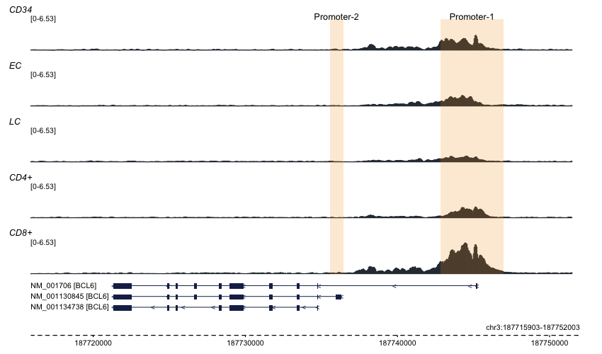

## Introduction

`trackplot.R` is a fast, simple, and minimal dependency R script to generate IGV style track plots (aka locus plots) from bigWig files.

### Usage

```r
download.file(url = "https://raw.githubusercontent.com/PoisonAlien/trackplot/master/trackplot.R", destfile = "trackplot.R")
source('trackplot.R') 

#Example usage:
trackplot(
  bigWigs = c("CD34.bw", "EC.bw", "LC.bw", "CD4p.bw", "CD8p.bw"),
  loci = "chr3:187,715,903-187,752,003",
  draw_gene_track = TRUE,
  build = "hg38",
  mark_regions = data.frame(chr = "chr3", start = 187743255, end = 187747473),
  custom_names = c("CD34", "EC", "LC", "CD4+", "CD8+")
)
```

</a>


### Features

 * Fast - Above example plot took less than a minute on my 5 year old [macbook Pro](https://support.apple.com/kb/sp715?locale=en_GB). 
 * Automatically queries UCSC genome browser for gene models.
 * Supports GTF and standard UCSC gene formats as well.
 * Customization: Each track can be customized for color, scale, and width.
 * Minimal dependency. Plots are generated in pure base R graphics. 

### Dependencies

`trackplot` has only two dependencies. 

* [data.table](https://cran.r-project.org/web/packages/data.table/index.html) R package - which itself has no dependency.
* [bwtool](https://github.com/CRG-Barcelona/bwtool) - a command line tool for processing bigWig files. Install and move the binary to a PATH (e.g; `/usr/local/bin`). If you have trouble installing the tool, follow [these](https://github.com/CRG-Barcelona/bwtool/issues/49#issuecomment-604477559) instructions. 
 
### Arguments

Available arguments

```r
#' @param bigWigs bigWig files. Default NULL. Required.
#' @param loci target region to plot. Should be of format "chr:start-end". e.g; chr3:187715903-187752003
#' @param chr chromosome of interest. Default NULL. This argument is mutually exclusive with `loci`
#' @param start start position. Default NULL. This argument is mutually exclusive with `loci`
#' @param end end interest. Default NULL. This argument is mutually exclusive with `loci`
#' @param nthreads Default 1.
#' @param binsize bin size to extract signal. Default 50 (bpbs).
#' @param draw_gene_track Default FALSE. If TRUE plots gene models overlapping with the queried region
#' @param gene_model File with gene models. Can be a gtf file or UCSC file format. Default NULL, automatically fetches gene models from UCSC server
#' @param isGTF Default FALSE. Set to TRUE if the `gene_model` is a gtf file.
#' @param tx transcript name to draw. Default NULL. Plots all transcripts overlapping with the queried region
#' @param gene gene name to draw. Default NULL. Plots all genes overlapping with the queried region
#' @param gene_fsize Font size. Default 0.8
#' @param gene_track_width Default 1 
#' @param scale_track_width Default 1 
#' @param query_ucsc Default FALSE. But switches to TREI when `gene_model` is FALSE
#' @param build Genome build. Default hg19
#' @param col Color for tracks. Default `#2f3640`. Multiple colors can be provided for each track
#' @param groupAutoScale Default TRUE
#' @param show_axis Default FALSE
#' @param custom_names Default NULL and Parses from the file names.
#' @param mark_regions genomic regions to highlight. A data.frame with three columns containing chr, start and end positions.
#' @param regions_track_width Default 1
```

### Caveat

 * Windows OS is not supported
 
