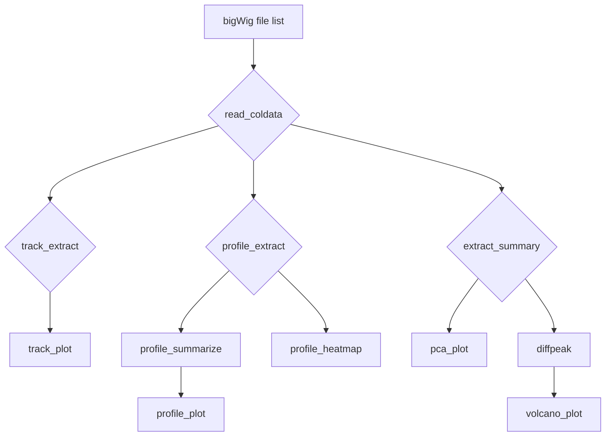

## trackplot - Fast and easy visualisation of bigWig files in R

<!-- badges: start -->
[](https://lifecycle.r-lib.org/articles/stages.html#experimental)
<!-- badges: end -->

## Introduction

`trackplot.R` is an ultra-fast, simple, and minimal dependency R script to generate IGV style track plots (aka locus plots), profile plots and heatmaps from bigWig files. 

## Installation

`trackplot.R` is a standalone R script and requires no installation. Just source it and you're good to go! See below for [dependencies](https://github.com/PoisonAlien/trackplot#dependencies).

```r
source("https://github.com/PoisonAlien/trackplot/blob/master/R/trackplot.R?raw=true")

# OR

download.file(url = "https://raw.githubusercontent.com/PoisonAlien/trackplot/master/R/trackplot.R", destfile = "trackplot.R")
source('trackplot.R') 

# OR If you prefer to have it as package

remotes::install_github(repo = "poisonalien/trackplot")
```

## Features

Why `trackplot`?

  * It's extremely fast since most of the heavy lifting is done by [bwtool](https://github.com/CRG-Barcelona/bwtool).  >15X faster than [deeptools](https://deeptools.readthedocs.io/en/develop/) for equivalent `profileplots` and `heatmaps` 
  * Lightweight and minimal dependency 
    - [data.table](https://cran.r-project.org/web/packages/data.table/index.html) and [bwtool](https://github.com/CRG-Barcelona/bwtool) are the only requirements. Similar R packages [GViz](https://bioconductor.org/packages/release/bioc/html/Gviz.html) and [karyoploteR](http://bioconductor.org/packages/release/bioc/html/karyoploteR.html) has over 150 dependencies.
    - Plots are generated in pure base R graphics (no ggplot2 or tidyverse packages)
  * Automatically queries UCSC genome browser for gene models, cytobands, and chromHMM tracks - making analysis reproducible.
  * Supports GTF and standard UCSC gene formats as well.
  * Customization: Each plot can be customized for color, scale, height, width, etc.
  * Tracks can be summarized per condition (by mean, median, max, min)
  * PCA and, optional differential peak analysis with `limma` when using uniformly processed, normalized bigWig files.

## Usage

Simple usage - Make a table of all the bigWig files to be analysed with `read_coldata()` and pass it to the downstream functions.



```r
#Path to bigWig files
bigWigs = c("H1_Oct4.bw", "H1_Nanog.bw", "H1_k4me3.bw", 
            "H1_k4me1.bw", "H1_k27ac.bw", "H1_H2az.bw", "H1_Ctcf.bw")

#Make a table of bigWigs along with ref genome build
bigWigs = read_coldata(bws = bigWigs, build = "hg19")
```

## trackplots

`track_extract()` and `track_plot()` are two functions to generate IGV style track plots (aka locus plots) from bigWig files. Additionally, `track_summarize` can summarize tracks by condition.
 
### Step-1: Extract signal from bigWig files 
```r
#Region to plot
oct4_loci = "chr6:31125776-31144789"

#Extract bigWig signal for a loci of interest
t = track_extract(colData = bigWigs, loci = oct4_loci)

#Or you can also specifiy a gene name instead of a loci 
# - loci and gene models will be automatically extracted from UCSC genome browser
t = track_extract(colData = bigWigs, gene = "POUF51")
```


### Step-2: Plot

#### Basic plot
```r
track_plot(summary_list = t)
```


#### Add cytoband and change colors for each track
```r
track_cols = c("#d35400","#d35400","#2980b9","#2980b9","#2980b9", "#27ae60","#27ae60")
track_plot(summary_list = t, 
          col = track_cols, 
          show_ideogram = TRUE)
```


#### Heighilight regions of interest (any bed files would do)

```r
oct4_nanog_peaks = c("H1_Nanog.bed","H1_Oct4.bed") #Peak files 
track_plot(summary_list = t, 
          col = track_cols, 
          show_ideogram = TRUE, 
          peaks = oct4_nanog_peaks)
```


#### Add some chromHMM tracks to the bottom

chromHMM data should be a bed file with the 4th column containing chromatin state. See here for an [example](https://github.com/PoisonAlien/trackplot/blob/master/inst/extdata/narrowpeak/H1_chromHMM.bed) file. 

Note that the color code for each of the 15 states are as described [here](https://genome.ucsc.edu/cgi-bin/hgTrackUi?g=wgEncodeBroadHmm&db=hg19). 
In case if it is different for your data, you will have to define your own color codes for each state and pass it to the argument `chromHMM_cols`

```r
chromHMM_peaks = "H1_chromHMM.bed"

track_plot(summary_list = t, 
          col = track_cols, 
          show_ideogram = TRUE, 
          peaks = oct4_nanog_peaks, chromHMM = chromHMM_peaks)
```


#### Add some chromHMM tracks from UCSC

UCSC has 9 cell lines for which chromHMM data is available. These can be added automatically in case if you dont have your own data.
In this case, use the argument `ucscChromHMM` with any values from TableName column of the below table.

```r
                    TableName    cell                      Description              Tissue Karyotype
1: wgEncodeBroadHmmGm12878HMM GM12878     B-lymphocyte, lymphoblastoid               blood    normal
2:  wgEncodeBroadHmmH1hescHMM H1-hESC             embryonic stem cells embryonic stem cell    normal
3:   wgEncodeBroadHmmHepg2HMM   HepG2         hepatocellular carcinoma               liver    cancer
4:   wgEncodeBroadHmmHepg2HMM    HMEC         mammary epithelial cells              breast    normal
5:    wgEncodeBroadHmmHsmmHMM    HSMM        skeletal muscle myoblasts              muscle    normal
6:   wgEncodeBroadHmmHuvecHMM   HUVEC umbilical vein endothelial cells        blood vessel    normal
```

```r
track_plot(summary_list = t, 
          col = track_cols, 
          show_ideogram = TRUE, 
          peaks = oct4_nanog_peaks, 
          ucscChromHMM = c("wgEncodeBroadHmmH1hescHMM", "wgEncodeBroadHmmNhlfHMM"))
```


## narrowPeaks and broadPeaks 

All of the above plots can also be generated with [narrowPeak](https://genome.ucsc.edu/FAQ/FAQformat.html#format12) or [broadPeak](https://genome.ucsc.edu/FAQ/FAQformat.html#format13) files as input. Here, 5th column containing scores are plotted as intensity. Color coding and binning of scores are as per [UCSC convention](https://genome.ucsc.edu/FAQ/FAQformat.html#format1)

`narrowPeak` is one of the output from macs2 peak caller and are easier to visualize in the absence of bigWig files.

```r
narrowPeaks = c("H1_Ctcf.bed", "H1_H2az.bed", "H1_k27ac.bed", 
                "H1_k4me1.bed", "H1_k4me3.bed", "H1_Nanog.bed", 
                "H1_Oct4.bed", "H1_Pol2.bed")

#Use peak as input_type
narrowPeaks = read_coldata(narrowPeaks, build = "hg19", input_type = "peak")

oct4_loci = "chr6:30,818,383-31,452,182" #633Kb region for example

narrowPeaks_track = track_extract(colData = narrowPeaks, loci = oct4_loci)

#Rest plotting is same
track_plot(summary_list = narrowPeaks_track, 
          show_ideogram = TRUE, 
          peaks = oct4_nanog_peaks, 
          ucscChromHMM = c("wgEncodeBroadHmmH1hescHMM", "wgEncodeBroadHmmNhlfHMM"))

```
  


## profileplots

`profile_extract()` -> `profile_summarize()` -> `profile_plot()` are functions to generate density based profile-plots from bigWig files.


  * Below example for summarizing approx. 3,671 peaks for 3 bigWig files takes ca. 3 seconds on my 5 year old [macbook Pro](https://support.apple.com/kb/sp715?locale=en_GB). This includes generating signal matrix, summarizing, and plotting. Equivalent deeptools commands takes 20 seconds.
  * Optionally, it can also query UCSC genome browser for refseq transcripts of desired assembly and summarize around TSS regions
  * Replicates can be collapsed into single value per condition

Example data from [GSE99183](https://www.ncbi.nlm.nih.gov/geo/query/acc.cgi?acc=GSE99183) where U87 glioma cell lines are treated with a DMSO and a BRD4 degradaer.

```r
bws = c("GSM2634756_U87_BRD4.bw", "GSM2634757_U87_BRD4_dBET_24h.bw", "GSM2634758_U87_BRD4_dBET_2h.bw")
bws = read_coldata(bws = bws, 
                  sample_names = c("BRD4", "BRD4_dBET_24h", "BRD4_dBET_2h"), 
                  build = "hg19")
```

### Refseq transcripts

```r
#Extract signals from bigWig files around refseq transcripts
pe_refseq = profile_extract(colData = bws, ucsc_assembly = TRUE, 
                            startFrom = 'start', up = 1500, down = 1500)

#Estimate mean signal
ps_refseq = profile_summarize(sig_list = pe_refseq) 

#Plot
profile_plot(ps_refseq)
```


### Custom BED regions

```r
#BRD4 binding sites 
bed = "GSM2634756_U87_BRD4_peaks.narrowPeak.gz"

#Center and extend 1500 both ways from the peak center
pe_bed = profile_extract(colData = bws, bed = bed, startFrom = "center", 
                          up = 1500, down = 1500, nthreads = 4)

#Estimate mean signal
ps_bed = profile_summarize(sig_list = pe_bed) 

#Plot
profile_plot(ps_bed)
```


## heatmap

Output from `profile_extract` can be used to draw a heatmap with `profile_heatmap`

```r
profile_heatmap(mat_list = pe_bed, top_profile = TRUE, zmaxs = 0.8)
```


## Dependencies

* [data.table](https://cran.r-project.org/web/packages/data.table/index.html) R package - which itself has no dependency.
* [bwtool](https://github.com/CRG-Barcelona/bwtool) - a command line tool for processing bigWig files. Install and move the binary to a PATH (e.g; `/usr/local/bin`). 
Or, you could also add the path where bwtool is located to R session with the below command.

```r
#Example
Sys.setenv(PATH = paste("/Users/anand/Documents/bwtool_dir/", Sys.getenv("PATH"), sep=":"))
```

* If you have trouble compiling the tool, follow [these](https://gist.github.com/PoisonAlien/e19b482ac6146bfb03142a0de1c4fbc8) instructions. Alternatively, you can download the pre-built binary for [macOS](https://www.dropbox.com/s/kajx9ya6erzyrim/bwtool_macOS.tar.gz?dl=1) or [centOS](https://www.dropbox.com/s/77ek89jqfhcmouu/bwtool_centOS_x86_64.tar.gz?dl=1)

***PSA*** If you find the tool useful, consider starrig this repository or upvoting this [Biostars thread](https://www.biostars.org/p/475853/) so that more poeple can find it :)

### Caveat

 * Windows OS is not supported
 


### Citation

If you find the script useful consider [citing bwtool](https://academic.oup.com/bioinformatics/article/30/11/1618/282756)

*Pohl A, Beato M. bwtool: a tool for bigWig files. Bioinformatics. 2014 Jun 1;30(11):1618-9. doi: 10.1093/bioinformatics/btu056. Epub 2014 Jan 30. PMID: [24489365](https://pubmed.ncbi.nlm.nih.gov/24489365/); PMCID: PMC4029031.*

### Acknowledgements 

[Joschka Hey](https://github.com/HeyLifeHD) for all the cool suggestions :)
